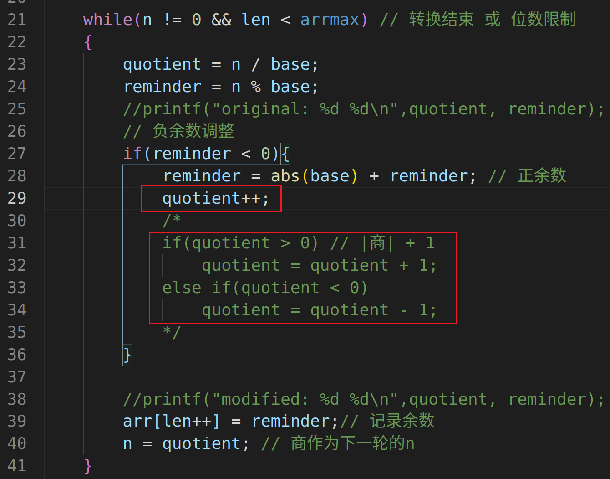
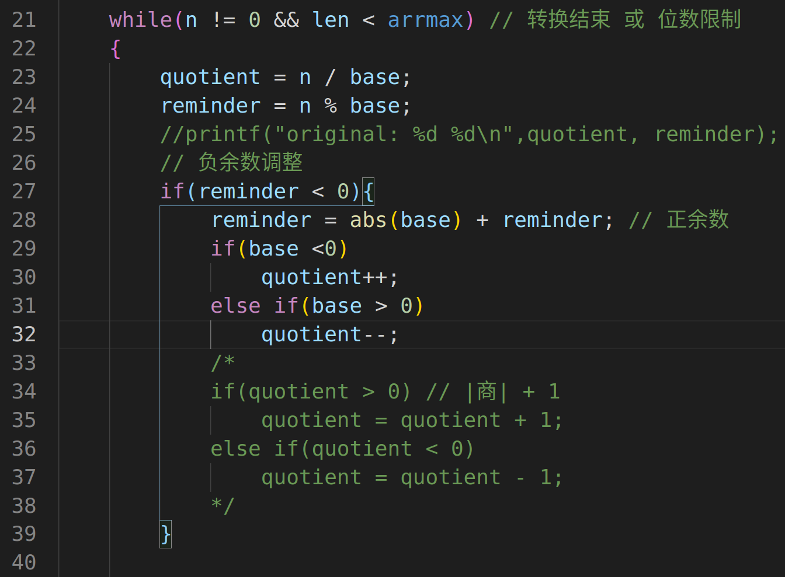

# 重要错误点

1. 第一次在洛谷作题，所有的OJ痛点应该都是输入输出格式

2. 针对这道题目错误点出在

   

对负余数 r 的转化中，将其加上除数 q 的绝对值(对其求补)使得余数变为正数，再调整商，使其满足n = k * q + r

对商 直接 +1，还是对商的绝对值+1,前者是正确的，推理如下
$$
n 是 需要转换的整数，q是基数，也是除数，k是商，r是余数，满足：\\ n = k \cdot q + r \\
或者 n \div q =k \cdots r \\ \\
若 r < 0,则 r = r + |q|,为了使r改变后，仍满足上式，即：\\
n = k \cdot q + r \\
n + |q| = k \cdot q + (r+ |q|) \\
n = k \cdot q -|q| + (r+ |q|) \\ \\
若 q <0, n  = k \cdot q - (-q) + (r+ |q|) = (k +1)\cdot q + (r+ |q|)  \\ 
若 q >0, n  = k \cdot q - (q) + (r+ |q|) = (k -1)\cdot q + (r+ |q|) \\
$$

所以出错的原因是，应该判断 base 的正负，来决定 商的 加减，虽然题目中已经规定了 base  R 小于0

完成这个题目，也得到了一个很棒的进制转换工具，可以使用。
